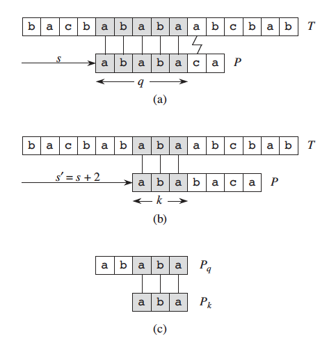

## KMP String-matching Algorithm
We now present a linear-time string-matching algorithm due to Knuth, Morris, and Pratt. This algorithm avoids computing the transition function \\(\delta\\) altogether, and its matching time is \\(\Theta(n)\\) using just an auxiliary function \\(\pi\\), which we pre-compute from the pattern in time \\(\Theta(m)\\)(length of the pattern) and store in an array \\(\pi[1..m]\\). The array \\(\pi\\) allows us to compute the transition function \\(\delta\\) efficiently.

Loosely speaking, for any state \\(q = 0, 1, ..., m\\) and any character \\(a\in \Sigma\\), the value \\(\pi[q]\\) contains the information we need to compute \\(\delta(q, a)\\) but that does not depend on \\(a\\).

### Prefix Function
The **prefix function** for a pattern encapsulates knowledge about how the pattern matches against shifts of itself. We can take advantage of this information to avoid testing useless shifts in the *naive pattern-matching* algorithm and to avoid pre-computing the full transition function for a *string-matching automaton*.

### How to avoid useless work


Consider the operation of the naive string matcher. Figure shows a particular shift \\(s\\) of a template containing the pattern \\(P = \\) ```ababaca``` against a text \\(T\\) . For this example, \\(q = 5\\) of the characters have matched successfully, but the 6th pattern character fails to match the corresponding text character. The information that \\(q\\) characters have matched successfully determines the corresponding text characters. Knowing these \\(q\\) text characters allows us to determine immediately that certain shifts are invalid. In the example of the figure, the shift \\(s + 1\\) is necessarily invalid, since the first pattern character ```(a)``` would be aligned with a text character that we know does not match the first pattern character, but does match the second pattern character ```(b)```. The shift \\(s' = s + 2\\) shown in part ```(b)``` of the figure, however, aligns the first three pattern characters with three text characters that must necessarily match. In general, it is useful to know the answer to the following question:

Given ```Pattern[0: q]``` matches ```Text[shift: shift + q]``` (```Pattern[q] != Text[shift + q]```), what is the least shift ```_shift > shift``` such that ```Text[_shift: _shift + k] == Pattern[0: k]```? 

In other words, given that ```Pattern[0: q]``` is a suffix of ```Text[shift: shift + q]```, what is the longest prefix ```Pattern[0: k]``` of ```Pattern[0: q]``` that is also a suffix of of ```Text[shift: shift + q]```

In any case, given new shift ```_shift``` we don’t need to compare the first ```k``` characters of ```Pattern``` with the corresponding characters of ```Text```. 

```_shift = shift + (q - k)```

Since it is given that ```Pattern[0: q]``` matches ```Text[shift: shift + q]```, the question can be restructured as: what is the greatest ```k < q``` where ```Pattern[0: k]``` is a suffix of ```Pattern[0: q]```. 

Thus we formalize the information that we precompute as follows. Given a pattern \\(P[1 .. m]\\), the **prefix function** for the pattern \\(P\\) is the function \\(\pi: {1, 2, .., m} \rightarrow {0, 1, .., m-1 }\\) such that:
\\[\pi[q] = max\{k: k < q \text{ and } P[0: k] \text{ is a suffix of } P[0: q]\}\\]

Thus \\(\pi[q]\\) is the smallest length in \\(P\\) I should go back to when \\(P[q]\\) doesn't match. 

```python
def kmp_matcher(T, P):
	result = []
	pi = compute_prefix_function(P)
	q = 0
	for i in range(len(T)):
		while q > 0 and P[q] != T[i]:
			q = pi[q - 1]
		if P[q] == T[i]:
			q += 1
		if q == len(P):
			result.append(i - q + 1)
			q = pi[q]
	return result

def compute_prefix_function(P):
	pi = [0 for i in len(P)]
	k = 0
	for q in range(1, len(P)):
		while k > 0 and P[k] != P[q]:
			k = pi[k - 1]
		if P[k] == P[q]
			k += 1
		pi[q] = k
	return pi
```

In ```compute_prefix_function```, ```k``` is both the length of the longest matching prefix/suffix, and the index of the next character to check. So in this subroutine, we are matching the prefix of ```P[0: k]``` against the suffix of ```P[0: q]``` where ```P[k]``` and ```P[q]``` is the next pair of characters to check. 

### Proof
